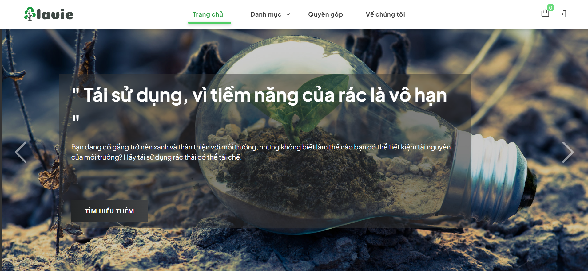

# LAVIE - BWD 2022 👋


> This is project which is made in the contest BWD 2022 ( Best Web Design in VKU). This website is the combine of ecommerce and fund raising selling, it propagandizes about eviroment and nature protection.

## Preview


### ✨ [Demo](https://bwd2022.vercel.app/)

## Run

```sh
yarn install
```
```sh
yarn && yarn preview
```

## Author

👤 **hoangtrung1801**

* Github: [@hoangtrung1801](https://github.com/hoangtrung1801)

## Show your support

Give a ⭐️ if this project helped you!


***
_This README was generated with ❤️ by [readme-md-generator](https://github.com/kefranabg/readme-md-generator)_
